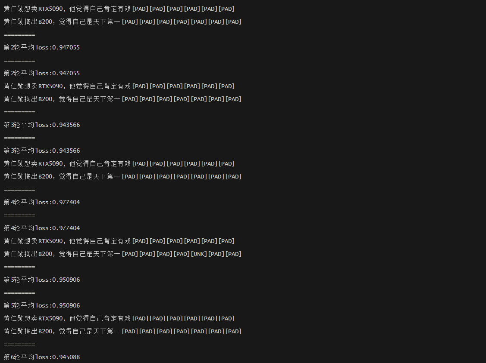

# Change the BERT model to a GPT-like Decoder


## Core Idea
1. 使用 `CNN/DailyMail` 数据集进行 文本摘要任务 (Text-Summarization Task)
2. 修改BERT的注意力掩码机制，从双向注意力改为单向注意力（类似GPT）
3. 修改预训练任务，从MLM改为CLM（因果语言建模）
4. 调整位置编码和输入处理方式


## Details
### 1. 模型架构改造：
- 继承自BertPreTrainedModel，保留了BERT的基础架构
- 设置is_decoder=True，启用因果注意力机制
- 添加了lm_head用于语言建模任务

### 2. 注意力机制改造：
- 实现了get_causal_attention_mask方法，生成upper triangular mask
- 确保每个token只能看到其之前的token，实现自回归特性

### 3. 训练目标改造：
- 从BERT的MLM改为GPT式的CLM（因果语言建模）
- 实现了标准的语言模型损失计算


## Project Structure
- `bert_decoder_3.py`: use transformers library's bert to implement a decoder

- `bert_decoder.py`: use pytorch to first to construct a bert from scratch, and then change it into a decoder


## Progress
---
- The first version `bert_decoder_3.py` is finished.


## Evaluation Metrics
- ROUGE


---
## Configuration
1. before running, you should manually copy the `vocab.txt` file from the bert-base-uncased directory to the this project directory.


## Run
- pretrain:
```bash
cd pretrain 
python bert_decoder_pretrain.py
```

- sft:
```bash
cd sft
python bert_decoder_sft.py
```


## Pre-training Snapshot (pytorch only)



## SFT snapshot (pytorch only)


## SFT snapshot (transformers only)

## Results


## Other things:
- if you want to create your own corpus, you can just copy any text from the internet and paste it into a txt file, then you can run the `clean_corpus.py` to clean the corpus.